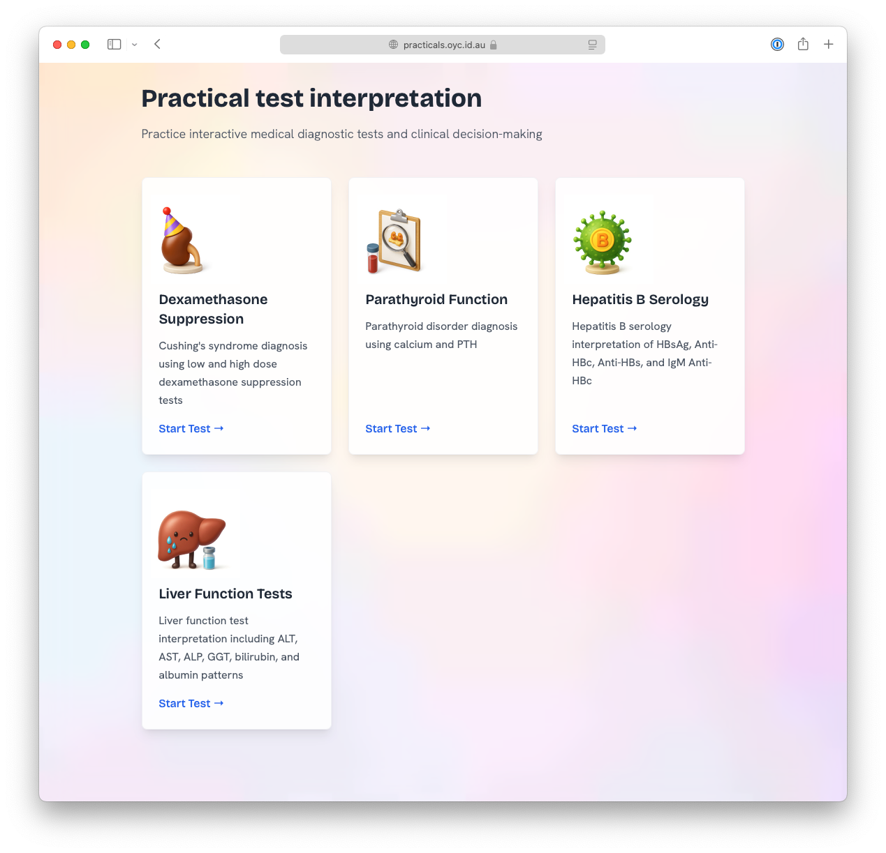

<h1>Practical test interpretation</h1>
<h3>https://practicals.oyc.id.au</h3>

This is a small project I threw together to interactively practice interpretation of basic tests. Try it out!

A goal of mine was to quickly make something useful, not something perfect. I've made judicious use of Claude Code
to create this site. There may be errors — use at your own peril! In particular, the reference values may not be entirely
accurate or up-to-date with the current Australian guidelines.
